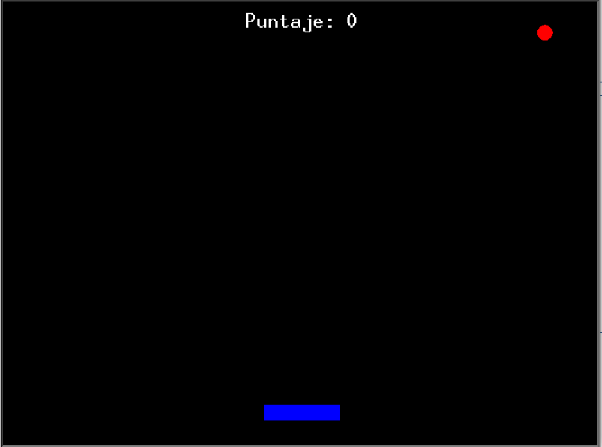
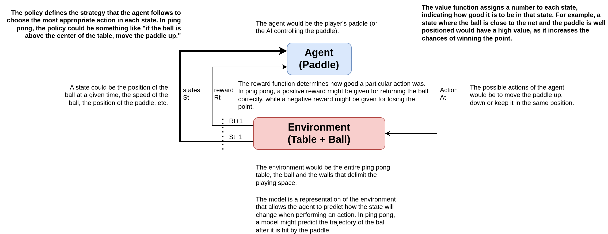
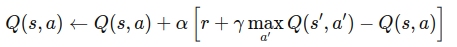

# Fundamentos del Aprendizaje por Refuerzo Multiagente (MARL) 🧠 basados en los principios de los sistemas emergentes 🐜🐜

Aprendizaje por Refuerzo Multiagente (MARL) es un área de la inteligencia artificial que se enfoca en cómo múltiples agentes autónomos pueden aprender a tomar decisiones a través de la interacción con un entorno compartido. Para entender los fundamentos de MARL, comencemos por desglosar los conceptos clave de manera sencilla [X].En MARL, en lugar de un solo agente, tenemos múltiples agentes que interactúan en el mismo entorno; por ejemplo, piensa en un juego de fútbol. Cada jugador (agente) necesita aprender a cooperar con sus compañeros y competir contra el equipo contrario para ganar el partido. Estos agentes pueden:

- Cooperar: Trabajar juntos para lograr un objetivo común.
- Competir: Intentar superar a los demás para lograr su propio objetivo.
- Mixto: Una combinación de cooperación y competencia.

 El Aprendizaje por Refuerzo (RL) es una técnica donde un agente aprende a tomar decisiones mediante ensayo y error, buscando maximizar una recompensa acumulada. Imagina a un niño aprendiendo a montar en bicicleta: prueba diferentes movimientos, se cae algunas veces, pero con el tiempo aprende a mantener el equilibrio y avanzar sin caerse.

- Agente: Es el aprendiz o el que toma decisiones.
- Entorno: Es el mundo con el que interactúa el agente.
- Acciones: Son las decisiones o movimientos que el agente puede realizar.
- Recompensas: Son señales que indican qué tan bien lo está haciendo el agente.
- Política: Es la estrategia que sigue el agente para decidir qué acción tomar en cada situación.

Por otra parte, los sistemas emergentes se caracterizan por comportamientos complejos que surgen de interacciones simples entre componentes individuales. Al aplicar estos principios al aprendizaje por refuerzo multiagente, consideramos lo siguiente:

- **Interacciones Locales:** Los agentes interactúan principalmente con su entorno inmediato y, de forma limitada, con otros agentes.
- **Reglas Simples:** Los agentes siguen reglas sencillas que, al combinarse, generan comportamientos complejos.
- **Descentralización:** No existe un controlador central; la coordinación surge de las interacciones entre agentes.
- **Adaptación y Aprendizaje:** Los agentes se adaptan y aprenden de sus experiencias, lo que conduce a la evolución del comportamiento del sistema.
- **Autoorganización:** El sistema se organiza a sí mismo en patrones o comportamientos sin guía externa.

## Desafíos Clave en MARL 🚧

El aprendizaje con múltiples agentes introduce varios desafíos adicionales:

### No Estacionariedad del Entorno
En RL tradicional, el entorno es generalmente fijo. En MARL, el entorno cambia constantemente porque otros agentes también están aprendiendo y cambiando sus estrategias. Lo que implica que los agentes deben adaptarse no solo al entorno, sino también a las acciones y aprendizajes de los otros agentes.

### Coordinación y Cooperación
Lograr que los agentes trabajen juntos eficazmente puede ser difícil, especialmente si no pueden comunicarse directamente. Esto implica que los agentes deben desarrollar estrategias para coordinar sus acciones y maximizar las recompensas compartidas.

**La cooperación** se refiere al proceso en el que dos o más agentes trabajan juntos voluntariamente hacia un objetivo común o compartido. En la cooperación, los agentes pueden estar dispuestos a sacrificar sus propios intereses individuales o recursos para beneficiar al grupo o para lograr una meta colectiva. Ejemplo: Ajustar la velocidad para evitar chocar con otros vehículos. Características clave de la cooperación:

- Objetivo compartido: Los agentes tienen metas comunes y trabajan para alcanzarlas juntos.
- Beneficio mutuo: Las acciones de los agentes están orientadas a beneficiar al grupo, no solo a sí mismos.
- Comunicación y entendimiento mutuo: Puede requerir que los agentes compartan información y comprendan las intenciones de los demás.
- Sacrificio personal: Los agentes pueden renunciar a ventajas individuales por el bien del grupo.

Por otra parte, **La coordinación** implica la organización de acciones o esfuerzos entre dos o más agentes para asegurar que trabajen juntos de manera eficiente y sin conflictos. La coordinación se enfoca en sincronizar y armonizar las acciones para lograr un resultado óptimo, evitando interferencias o duplicación de esfuerzos. A diferencia de la cooperación, la coordinación no necesariamente requiere que los agentes compartan un objetivo común o que estén dispuestos a sacrificar sus propios intereses. Ejemplo: Detenerse para permitir que una ambulancia pase rápidamente. Características clave de la coordinación:

- Sincronización de acciones: Los agentes alinean sus actividades en tiempo y forma.
- Prevención de conflictos: Se evitan interferencias o colisiones entre las acciones de los agentes.
- Independencia de objetivos: Los agentes pueden tener metas individuales distintas, pero aún así necesitan coordinarse.
- Comunicación mínima: A veces, la coordinación puede lograrse con información limitada o señales indirectas.

Comprender estas diferencias es crucial en campos como la inteligencia artificial y la robótica, donde diseñar sistemas que puedan coordinarse y cooperar efectivamente puede llevar a soluciones más eficientes y armoniosas en entornos multiagente.

### Asignación de Créditos
Determinar cómo las acciones individuales de un agente contribuyen al resultado global. Lo que es difícil saber qué agente merece crédito por una recompensa obtenida en equipo.

## Fundamentos de MARL 🧩

**Agentes y Entorno**
- Cada agente tiene su propia percepción del entorno, que puede ser completa o limitada.
- Los agentes toman acciones basadas en su percepción y política.
- El entorno responde a las acciones de todos los agentes, proporcionando nuevas observaciones y recompensas.

**Políticas y Aprendizaje**
- Una política es la estrategia que un agente sigue para decidir sus acciones.
- Los agentes usan algoritmos de aprendizaje, como Q-learning, para actualizar sus políticas basados en las recompensas recibidas.
- En MARL, los agentes pueden aprender de manera independiente o conjunta.

**Tipos de Interacciones entre Agentes**
- Cooperativo: Todos los agentes comparten el mismo objetivo.
- Competitivo: Los agentes tienen objetivos opuestos.
- Mixto: Combina elementos cooperativos y competitivos.

## Algoritmos Básicos en MARL 📚
Algunos algoritmos comunes utilizados en MARL incluyen:

- Q-learning Independiente
Cada agente aplica Q-learning por su cuenta, sin considerar las acciones de los demás. Tiene como ventaja su Simplicidad pero  puede ser ineficiente debido a la no estacionariedad del entorno.
- Aprendizaje Conjunto: Los agentes aprenden una política conjunta que considera las acciones de todos. Tiene como ventaja que Mejora su coordinación, pero el espacio de estados y acciones se vuelve exponencialmente grande con más agentes.
- Métodos Basados en Valor y Política. En el caso de los Métodos de Valor, los agentes estiman el valor de los estados o acciones; que con los Métodos de Política, los agentes aprenden directamente una política sin estimar valores.

# Caso de estudio
## Juego de Ping Pong doble cooperativo
### Descripción del juego

El Juego de Ping Pong Doble Cooperativo es una variante del tenis de mesa tradicional en la que dos jugadores trabajan juntos  en equipo (mismo lado) para mantener la pelota en juego el mayor tiempo posible. A diferencia del juego competitivo, donde los jugadores intentan vencer al oponente, en esta modalidad cooperativa el objetivo es colaborar para lograr una meta común, es decir, lograr el mayor número posible de golpes consecutivos, promoviendo la coordinación y el trabajo en equipo.

### Relación del juego de ping pong cooperativo, los elementos claves de MARL y sistemas emergentes
A continuación, reestructuraremos el enfoque anterior para implementar Multi-Agent Reinforcement Learning (MARL) en el juego Pong con dos jugadores que cooperan y coordinan, tomando en cuenta los principios de los sistemas emergentes. Nos centraremos en cómo interacciones simples y locales entre agentes pueden conducir a comportamientos complejos y coordinados sin necesidad de control centralizado.

||**Definición**|**Ejemplo**|
| :- | :-: | :-: |
|Acciones (Actions) **(A)**|Las acciones son las decisiones o movimientos que un agente puede realizar en un entorno dado.|El jugador puede tomar dos acciones: mover la pala hacia arriba o hacia abajo. Estas acciones impactan directamente en la posición del jugador y, por lo tanto, en la capacidad de devolver la pelota.|
|Política (Policy)**(π)**|La política es la estrategia o regla que el agente sigue para decidir qué acción tomar en un estado dado.|Una política simple podría ser: "Si la pelota está por encima de la pala, mueve la pala hacia arriba; si está por debajo, mueve la pala hacia abajo". En términos de RL, una política determina cómo el jugador actúa en función de la posición actual de la pelota.|
|Función de Valor (Value Function)**(Q)**|La función de valor estima la utilidad a largo plazo de un estado, es decir, el valor esperado del retorno futuro que puede recibir el agente desde un estado particular.|El valor de un estado podría representar la probabilidad de que la pelota sea devuelta exitosamente y se mantenga en juego durante más tiempo, dado que el jugador actúa óptimamente desde esa posición.Por ejemplo, si la pelota está cerca del borde superior de la pantalla, el estado podría tener un valor más bajo porque es más difícil devolver la pelota en esa posición.|
|Función de Recompensa (Reward Function):**( R )**|La función de recompensa proporciona feedback inmediato sobre la bondad de una acción en un estado dado, generalmente en forma de una señal numérica.|Una recompensa positiva se podría otorgar cada vez que el jugador devuelve la pelota con éxito (por ejemplo, +1 por cada rebote exitoso).Una recompensa negativa podría ser otorgada si la pelota pasa más allá de la pala y el jugador pierde (-1 por perder).La recompensa guía al agente (jugador) a maximizar la cantidad de rebotes y, por lo tanto, mejorar su estrategia de juego.|
|Modelo **(Model)**:|Un modelo en RL predice cómo se va a comportar el entorno en respuesta a las acciones del agente, es decir, predice las transiciones entre estados y las recompensas asociadas.| El modelo podría predecir cómo cambiará la posición de la pelota después de que el jugador mueva la pala hacia arriba o hacia abajo. Aunque en un entorno RL puro, el agente aprendería estas transiciones a través de la interacción, en este juego se asume que las reglas físicas de la pelota son conocidas (como la reflexión de la pelota en los bordes o la colisión con la pala).|

En un contexto de aprendizaje por refuerzo, un agente (en este caso, el jugador) aprendería a jugar al ping pong optimizando una política que maximiza las recompensas acumuladas (por ejemplo, mantener la pelota en juego durante el mayor tiempo posible) al tomar acciones (mover la pala) basadas en la función de valor que evalúa la probabilidad de éxito futuro desde un estado dado. El modelo puede estar implícito en el entorno, prediciendo cómo la pelota reacciona a las acciones del jugador. Este marco de RL podría aplicarse para desarrollar un agente autónomo capaz de jugar al ping pong aprendiendo a través de la experiencia, sin necesidad de reglas predefinidas.

### Diseño de un sistema MARL basados en principios emergentes
1. Definición del Entorno y los Agentes
**Entorno:** El juego Pong con dos paletas controladas por agentes y una pelota.
**Agentes:** Dos jugadores (paletas) que actúan de forma autónoma y descentralizada.
**Percepción Local:** Cada agente percibe solo información local:
- Su propia posición.
- La posición y velocidad de la pelota relativa a sí mismo.
- Opcionalmente, información limitada sobre el otro agente (por ejemplo, su posición relativa).

2. Diseño de Reglas Simples y Acciones
**Acciones Disponibles:**
- Mover hacia arriba.
- Mover hacia abajo.
- Quedarse quieto.

**Política de Acción:** Los agentes utilizan una política epsilon-greedy basada en su percepción local para seleccionar acciones.

3. Aprendizaje Descentralizado e Independiente: A traves del algoritmo Q-Learning Independiente, cada agente mantiene su propia tabla Q y actualiza sus valores basándose en sus experiencias individuales.

**Recompensas Locales:**
- Positivas cuando el agente devuelve la pelota exitosamente.
- Negativas cuando falla al devolver la pelota.
- Objetivo Compartido: Mantener la pelota en juego el mayor tiempo posible, lo que incentiva la cooperación emergente.

4. Interacciones entre Agentes
- Coordinación Indirecta: Los agentes influyen en el comportamiento del otro a través del entorno (la pelota).
- Comunicación Limitada (Opcional): Se puede permitir una comunicación mínima para mejorar la coordinación sin centralizar el control.

5. Autoorganización y Comportamiento Emergente
- Adaptación Mutua: Los agentes ajustan sus políticas basándose en las acciones observadas del otro agente.
- Desarrollo de Estrategias: A través del aprendizaje, pueden surgir estrategias como posicionamiento óptimo o roles complementarios.

### Pasos Detallados de Implementación

**Paso 1:** Configuración del Entorno: Corresponde al espacio de Estados Locales, para cada agente incluye:
- Posición de la paleta (y_agente).
- Posición y velocidad de la pelota relativa al agente (delta_x_pelota, delta_y_pelota, v_x_pelota, v_y_pelota).

> Nota: Para reducir la complejidad se puede aplicar la discretización que consiste en convertir valores continuos en categorías discretas

**Paso 2:** Definición de las Acciones y Políticas
* Acciones:
    - Arriba, Abajo, Quieto.
    - Política Epsilon-Greedy:
* Con probabilidad epsilon, el agente explora seleccionando una acción aleatoria.
* Con probabilidad 1 - epsilon, explota seleccionando la acción con el mayor valor Q.

**Paso 3:** Estructura de Recompensas Locales, pero tambien se podria agregar opcionalmente, una pequeña penalización por cada movimiento para incentivar la eficiencia.
- +1 por devolver la pelota exitosamente.
- -1 por fallar al devolver la pelota.

**Paso 4:** Algoritmo de Q-Learning Descentralizado, para cada agente y en cada paso de tiempo:

1. Observación del Estado Local s.
2. Selección de Acción a: Usando la política epsilon-greedy.
3. Ejecución de la Acción a: Actualizar la posición de la paleta según la acción.
4. Actualización del Entorno: El entorno actualiza la posición y velocidad de la pelota.
5. Recepción de Recompensa r: Basada en el resultado de la acción (éxito o fallo al devolver la pelota).
6. Observación del Nuevo Estado s'.
7. Actualización de la Tabla Q:

   

   Donde:
   1. Q(s,a) es el valor Q para el estado actual s y la acción a.
   1. α es la tasa de aprendizaje (learning rate).
   1. r es la recompensa obtenida después de tomar la acción a.
   1. γ es el factor de descuento, que determina la importancia de las recompensas futuras.
   1. es el valor Q máximo para el siguiente estado s′ y todas las acciones posibles a′.

**Paso 5:** Emergencia de la Coordinación
* Influencia Mutua a través del Entorno:
    - Las acciones de un agente afectan indirectamente las experiencias del otro.
* Aprendizaje Adaptativo:
    - Los agentes aprenden a predecir el comportamiento de la pelota y del otro agente, ajustando sus acciones en consecuencia.
* Comportamientos Emergentes:
    - Sin programación explícita, pueden surgir patrones de juego cooperativo.

**Paso 6:** Evaluación y Mejora
* Métricas de Rendimiento:
    - Tiempo promedio que la pelota permanece en juego.
* Frecuencia de devoluciones exitosas.
    - Ajuste de Parámetros:
    - Ajustar \alpha, \gamma y epsilon para mejorar la convergencia y el rendimiento.
* Introducción de Variabilidad:
    - Modificar condiciones del juego para fomentar la adaptabilidad (por ejemplo, cambiar la velocidad de la pelota).

## Herramientas utiles
- Convertir WORD a Markdown Online [Aspose](https://products.aspose.app/words/conversion/word-to-md)

## Bibliografía

- [1] Y. -C. Choi and H. -S. Ahn, "A survey on multi-agent reinforcement learning: Coordination problems," *Proceedings of 2010 IEEE/ASME International Conference on Mechatronic and Embedded Systems and Applications*, QingDao, China, 2010, pp. 81-86
- [2] Rana, A.S., Iqbal, F., Siddiqui, A.S. and Thomas, M.S. (2019), Hybrid methodology to analyse reliability and techno-economic evaluation of microgrid configurations. IET Gener. Transm. Distrib., 13: 4778-4787.
- [3] Sutton, Richard S., and Andrew G. Barto. *Reinforcement Learning: An Introduction*. MIT Press, 2018. 
- [4] Ris-Ala, R. (2023). *Fundamentals of Reinforcement Learning*. Springer Nature Switzerland.
